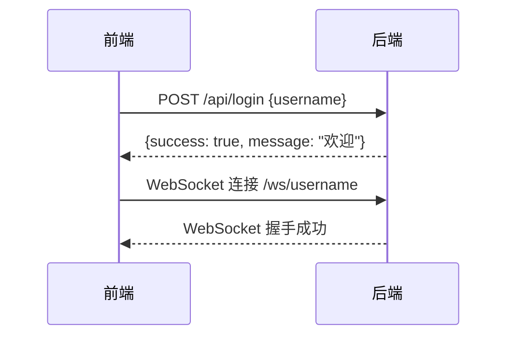
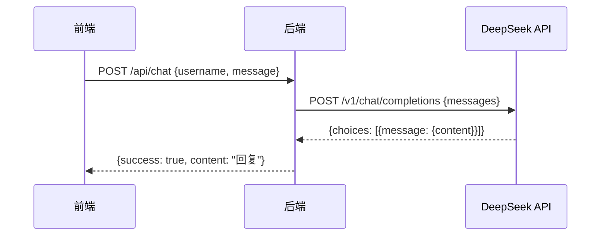
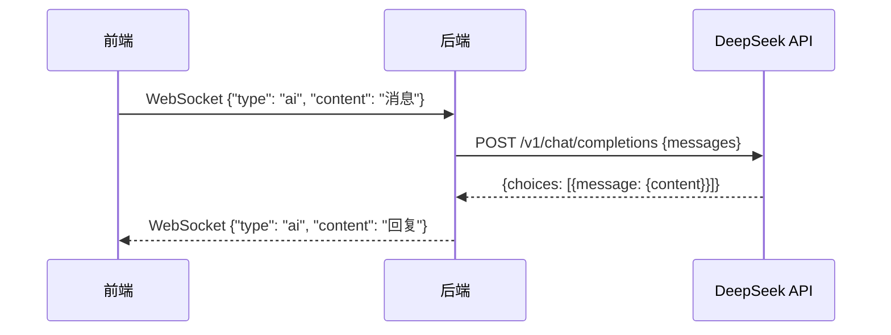
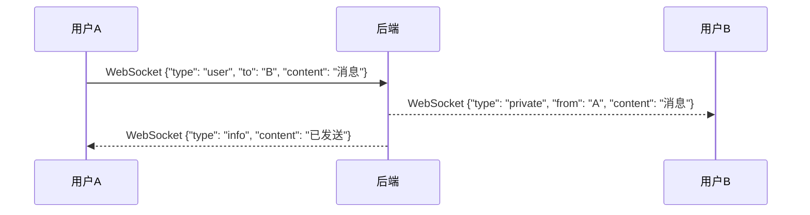

# 前后端对接文档

## 1. 对接概述

本文档详细描述前端 Vue3 应用与后端 FastAPI 服务之间的接口对接规范，包括 RESTful API 和 WebSocket 实时通信。

## 2. 对接环境

### 2.1 开发环境

| 环境 | 地址 | 说明 |
|------|------|------|
| 后端服务 | http://localhost:8000 | FastAPI 服务 |
| 前端服务 | http://localhost:5173 | Vue3 + Vite 开发服务器 |

### 2.2 配置要求

**前端配置**:

```env
VITE_API_URL=http://localhost:8000/api
VITE_WS_URL=ws://localhost:8000/ws
```

**后端配置**:

```json
{
    "server": {
        "host": "0.0.0.0",
        "port": 8000
    },
    "cors": {
        "allow_origins": ["http://localhost:5173"]
    }
}
```

## 3. RESTful API 对接

### 3.1 接口列表

| 接口 | 方法 | 前端调用方式 | 后端实现 |
|------|------|--------------|----------|
| `/api/login` | POST | 用户登录 | routes.py:45-52 |
| `/api/chat` | POST | AI 对话 | routes.py:10-23 |
| `/api/users` | GET | 获取在线用户 | routes.py:24-27 |
| `/api/private` | POST | 发送私聊 | routes.py:28-44 |
| `/api/history/{username}` | GET | 获取聊天历史 | routes.py:53-57 |
| `/health` | GET | 健康检查 | main.py:54-56 |

### 3.2 接口详细说明

#### 3.2.1 用户登录

**前端调用**:
```typescript
const login = async (username: string) => {
  const response = await fetch(`${API_BASE_URL}/login`, {
    method: 'POST',
    headers: {
      'Content-Type': 'application/json',
    },
    body: JSON.stringify({ username }),
  });
  return response.json();
};
```

**后端处理**:
```python
@router.post("/login", response_model=LoginResponse)
async def login(request: LoginRequest):
    username = request.username.strip()
    if not username:
        return LoginResponse(success=False, message="用户名不能为空")
    if username in online_users:
        return LoginResponse(success=False, message="用户名已被占用")
    return LoginResponse(success=True, message=f"欢迎 {username}")
```

**请求结构**:
```json
{
    "username": "string (必填，用户名)"
}
```

**响应结构**:
```json
{
    "success": true,
    "message": "欢迎 username"
}
```

#### 3.2.2 AI 对话

**前端调用**:
```typescript
const chat = async (username: string, message: string) => {
  const response = await fetch(`${API_BASE_URL}/chat`, {
    method: 'POST',
    headers: {
      'Content-Type': 'application/json',
    },
    body: JSON.stringify({ username, message }),
  });
  return response.json();
};
```

**请求结构**:
```json
{
    "message": "string (必填，用户消息)",
    "username": "string (必填，用户名)"
}
```

**响应结构**:
```json
{
    "success": true,
    "content": "AI 回复内容",
    "error": ""
}
```

#### 3.2.3 获取在线用户

**前端调用**:
```typescript
const getOnlineUsers = async () => {
  const response = await fetch(`${API_BASE_URL}/users`);
  return response.json();
};
```

**响应结构**:
```json
{
    "success": true,
    "users": ["user1", "user2"]
}
```

#### 3.2.4 发送私聊消息

**前端调用**:
```typescript
const sendPrivate = async (from: string, to: string, content: string) => {
  const response = await fetch(`${API_BASE_URL}/private`, {
    method: 'POST',
    headers: {
      'Content-Type': 'application/json',
    },
    body: JSON.stringify({ from_user: from, to_user: to, content }),
  });
  return response.json();
};
```

**请求结构**:
```json
{
    "from_user": "string (必填，发送方)",
    "to_user": "string (必填，接收方)",
    "content": "string (必填，消息内容)"
}
```

**响应结构**:
```json
{
    "success": true,
    "message": "已发送给 username"
}
```

## 4. WebSocket 对接

### 4.1 连接端点

```
ws://localhost:8000/ws/{username}
```

### 4.2 连接流程

```
前端 → 登录成功 → 连接 WebSocket → 发送消息 → 接收响应
```

### 4.3 消息协议

#### 4.3.1 消息类型定义

| 类型 | 方向 | 说明 | 数据结构 |
|------|------|------|----------|
| ai | 双向 | AI 对话 | `{"type": "ai", "content": "消息"}` |
| user | 前端→后端 | 私聊请求 | `{"type": "user", "to": "用户", "content": "消息"}` |
| private | 后端→前端 | 私聊消息 | `{"type": "private", "from": "用户", "content": "消息"}` |
| users | 双向 | 用户列表 | `{"type": "users"}` / `{"type": "users", "users": [...]}` |
| ping | 前端→后端 | 心跳请求 | `{"type": "ping"}` |
| pong | 后端→前端 | 心跳响应 | `{"type": "pong"}` |
| info | 后端→前端 | 系统信息 | `{"type": "info", "content": "消息"}` |
| error | 后端→前端 | 错误信息 | `{"type": "error", "content": "消息"}` |

#### 4.3.2 前端实现

```typescript
class ChatWebSocket {
  private ws: WebSocket | null = null;
  private onMessageCallback: ((data: WebSocketMessage) => void) | null = null;

  connect(username: string) {
    this.ws = new WebSocket(`${WS_URL}/${username}`);
    
    this.ws.onopen = () => {
      console.log('WebSocket connected');
    };
    
    this.ws.onmessage = (event) => {
      const data: WebSocketMessage = JSON.parse(event.data);
      this.onMessageCallback?.(data);
    };
    
    this.ws.onclose = () => {
      console.log('WebSocket disconnected');
    };
  }

  send(data: object) {
    this.ws?.send(JSON.stringify(data));
  }

  setOnMessage(callback: (data: WebSocketMessage) => void) {
    this.onMessageCallback = callback;
  }
}
```

#### 4.3.3 后端实现

```python
@app.websocket("/ws/{username}")
async def websocket_endpoint(websocket: WebSocket, username: str):
    await websocket.accept()
    online_users[username] = websocket
    
    if username not in chat_histories:
        chat_histories[username] = []
    
    try:
        while True:
            data = await websocket.receive_json()
            message_type = data.get("type")
            content = data.get("content", "")
            
            if message_type == "ai":
                history = chat_histories[username]
                history.append({"role": "user", "content": content})
                answer = await call_deepseek_async(history)
                history.append({"role": "assistant", "content": answer})
                await websocket.send_json({"type": "ai", "content": answer})
            
            elif message_type == "user":
                to_user = data.get("to")
                if to_user in online_users:
                    target_ws = online_users[to_user]
                    await target_ws.send_json({
                        "type": "private",
                        "from": username,
                        "content": content
                    })
                    await websocket.send_json({"type": "info", "content": f"已发送给 {to_user}"})
                else:
                    await websocket.send_json({"type": "error", "content": f"用户 {to_user} 不在线"})
            
            elif message_type == "users":
                user_list = list(online_users.keys())
                await websocket.send_json({"type": "users", "users": user_list})
            
            elif message_type == "ping":
                await websocket.send_json({"type": "pong"})
    
    except WebSocketDisconnect:
        online_users.pop(username, None)
```

## 5. 数据流转图

### 5.1 登录流程



### 5.2 AI 对话流程（REST）



### 5.3 AI 对话流程（WebSocket）



### 5.4 私聊流程



## 6. 错误处理规范

### 6.1 错误类型

| 错误码 | 错误信息 | 处理方式 |
|--------|----------|----------|
| 400 | 请求参数错误 | 提示用户检查输入 |
| 401 | 未授权 | 跳转到登录页面 |
| 500 | 服务器错误 | 提示用户稍后重试 |
| - | 网络错误 | 提示用户检查网络 |
| - | 用户名已被占用 | 提示用户更换用户名 |
| - | 用户不在线 | 提示用户对方不在线 |

### 6.2 前端错误处理示例

```typescript
const handleError = (error: any) => {
  if (error.response) {
    const { status, data } = error.response;
    switch (status) {
      case 400:
        alert(data.message || '请求参数错误');
        break;
      case 401:
        alert('请先登录');
        // 跳转到登录
        break;
      case 500:
        alert('服务器错误，请稍后重试');
        break;
      default:
        alert(data.message || '未知错误');
    }
  } else if (error.message) {
    alert('网络错误，请检查网络连接');
  }
};
```

## 7. 心跳机制

### 7.1 实现说明

- **前端**: 每 30 秒发送一次 `ping` 消息
- **后端**: 收到 `ping` 后立即返回 `pong`
- **超时处理**: 超过 60 秒未收到响应则断开连接并重连

### 7.2 前端心跳实现

```typescript
let heartbeatTimer: number | null = null;

const startHeartbeat = () => {
  heartbeatTimer = window.setInterval(() => {
    if (ws.readyState === WebSocket.OPEN) {
      ws.send(JSON.stringify({ type: 'ping' }));
    }
  }, 30000); // 30 秒
};

const stopHeartbeat = () => {
  if (heartbeatTimer) {
    clearInterval(heartbeatTimer);
    heartbeatTimer = null;
  }
};
```

## 8. 安全性考虑

### 8.1 CORS 配置

后端需配置允许前端域名：

```python
app.add_middleware(
    CORSMiddleware,
    allow_origins=["http://localhost:5173"],
    allow_credentials=True,
    allow_methods=["*"],
    allow_headers=["*"],
)
```

### 8.2 输入验证

- 后端使用 Pydantic 进行数据验证
- 前端需对用户输入进行过滤和转义
- 防止 XSS 攻击

### 8.3 API 密钥保护

- DeepSeek API 密钥存储在后端配置中
- 不要在前端代码中暴露密钥
- 使用环境变量配置敏感信息

## 9. 测试对接

### 9.1 测试步骤

1. **启动后端服务**:
   ```bash
   cd backend/webchat
   pip install -r requirements.txt
   python main.py
   ```

2. **启动前端服务**:
   ```bash
   cd frontend
   npm install
   npm run dev
   ```

3. **测试登录**:
   - 访问前端页面
   - 输入用户名登录
   - 验证 WebSocket 连接成功

4. **测试 AI 对话**:
   - 发送消息
   - 验证收到 AI 回复

5. **测试私聊**:
   - 打开两个浏览器窗口
   - 使用不同用户名登录
   - 发送私聊消息
   - 验证双方都能收到消息

### 9.2 测试工具

- **Postman**: 测试 REST API
- **WebSocket King**: 测试 WebSocket 连接
- **浏览器控制台**: 查看日志和调试信息

## 10. 常见问题

### 10.1 跨域问题

**问题**: 前端请求后端时出现 CORS 错误

**解决**: 检查后端 CORS 配置，确保 `allow_origins` 包含前端域名

### 10.2 WebSocket 连接失败

**问题**: WebSocket 无法建立连接

**解决**:
- 检查后端服务是否正常运行
- 检查 WebSocket 地址是否正确
- 检查防火墙设置

### 10.3 消息发送失败

**问题**: 消息发送后没有收到响应

**解决**:
- 检查网络连接
- 检查后端日志
- 确认用户已登录且在线

### 10.4 对话历史丢失

**问题**: 刷新页面后对话历史消失

**解决**: 当前实现为内存存储，生产环境需配置持久化存储（如 Redis、数据库）